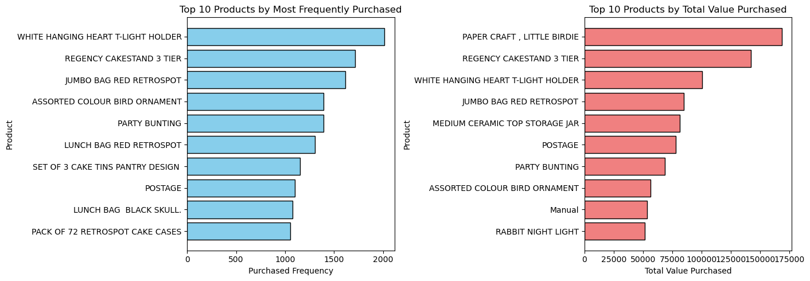
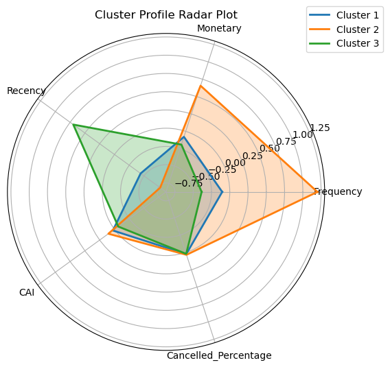

# Customer Segmentation Business Analysis Report

- ### Project Objective and Overview
    This project aims to compile a business analysis report from a business consultant's perspective through segmentation analysis of an online retail dataset. This project first deploys classical EDA methods to provide an overview of the dataset. Subsequently, RFM (Recency, Frequency, Monetary) indexes are created, which perform as the features used for segmentation. In addition, cancelation rate and customer activity indexes are also created to provide additional information on consumer characteristics. A  business analysis report aimed at providing next-step suggestions is derived from the results of segmentation analysis.

- ### Data Source
  The dataset used for this analysis is the **"Online Retail" Dataset (retail.xlsx)** dataset, containing transaction data from 01/12/2010 to 09/12/2011 of a UK-based online retailer. This data et was created by Daqing Chen and downloaded from the [UC Irvine Machine Learning Repository](https://archive.ics.uci.edu/dataset/352/online+retail).

- ### Data Structure
  This dataset contains 541,909 entries, with a grain of one transaction per item per customer, and eight columns, with each column representing features related to that particular news entry. A snapshot of the dataset is depicted in the following table.
  | InvoiceNo | StockCode | Description                             | Quantity | InvoiceDate          | UnitPrice | CustomerID | Country         |
  |-----------|----------|-----------------------------------------|----------|----------------------|-----------|------------|----------------|
  | 536365    | 85123A   | WHITE HANGING HEART T-LIGHT HOLDER     | 6        | 2010-12-01 08:26:00  | 2.55      | 17850.0    | United Kingdom |
  | 536365    | 71053    | WHITE METAL LANTERN                    | 6        | 2010-12-01 08:26:00  | 3.39      | 17850.0    | United Kingdom |
  | 536365    | 84406B   | CREAM CUPID HEARTS COAT HANGER         | 8        | 2010-12-01 08:26:00  | 2.75      | 17850.0    | United Kingdom |
  
  *Sample snapshot of dataset*

- ### Data Cleaning and Preprocessing
  The purpose of this phase is to preprocess the data for clustering. Since there are no missing values in this dataset, the main goal is to identify 1) duplicate values and 2) remove canceled transactions from clustering analysis. The reason to remove canceled transactions is that since these transactions are not finished, they should be analyzed separately from other transactions in order to discover which items are most often canceled. 

- ### Exploratory Data Analysis
  After preprocessing, EDA is thus conducted in order to provide an overview of the current dataset. The following EDAs are performed:
  - #### Summary Statistics
    The following tables are the summary statistics of the qualitative and quantitative variables, respectively. Note that key and date columns (*InvoiceNo*, *StockCode*, *InvoiceDate*, *CustomerID*) are removed in this step of the analysis.
    | Attribute   | Count  | Unique | Top                                      | Freq  |
    |------------|--------|--------|------------------------------------------|-------|
    | Description | 401604 | 3896   | WHITE HANGING HEART T-LIGHT HOLDER      | 2058  |
    | Country    | 401604 | 37     | United Kingdom         | 356728 |
    
    *Summary statistics of qualitative variables*

    | Attribute   | Count    | Mean     | Std Dev     | Min       | 25%  | 50%  | 75%  | Max      |
    |------------|---------|---------|------------|----------|------|------|------|---------|
    | Quantity   | 401604.0 | 12.1833  | 250.2830   | -80995.0  | 2.00 | 5.00 | 12.00 | 80995.0  |
    | UnitPrice  | 401604.0 | 3.4741   | 69.7640    | 0.0       | 1.25 | 1.95 | 3.75  | 38970.0  |

    *Summary statistics of quantitative variables*

    Furthermore, we would also want to know the unique values corresponding to each feature:
    - Number of entries: 401604
    - Number of unique Customer IDs: 4372
    - Number of unique Countries: 37
    - Number of unique Products: 3684
    - Number of unique Transactions: 22190 
      
    As a result, we can identify that the majority of the products of this retailer are low-priced items.

  - #### Country Statistics
    In addition to basic summary statistics, we would also like to know where the customers and transactions have been made. Therefore, we can plot frequency histograms by transaction and customer, respectively. As a result, we can identify that the majority of our customers and transactions are based in the United Kingdom, with other Western European countries such as Germany and France following. 
    
    *Frequency histogram by transaction (left) and by customer (right)*

  - #### Product Statistics
    To analyze the top products sold, we can identify the top products sold by quantity and by total value. We can identify that the top products sold either by quantity or by value are similar, such as *WHITE HANGING HEART T_LIGHT HOLDER*, *REGENCY CAKESTAND 3 TIER*, and *JUMBO BAG RED RETROSPOT* are all in the top 5 products by quantity and by value.
    

  - #### Canceled Product Statistics
    In addition to successful transactions, identifying products that are frequently canceled could also provide insights into lowering cancellation rates in the future. Similarly, we can also analyze most canceled products by both quantity and value. We can observe that the top product by value *PAPER CRAFT, LITTLE BIRDIE* is also the top canceled product by value. Further analysis into reasons why customers return these products could potentially improve both customer experience and reduce costs derived from transaction cancellations. 
    

- ### Index Creation
  - #### RFM Indexes
    RFM indexes are commonly used in customer segmentation, serving as a basis of segmentation based on consumer purchasing behavior. In particular, the indexes are operationalized with the following methods:

    - **Recency Index:**
    The Recency Index represents how recently a customer has completed a purchase. In this analysis, it is operationalized by computing the difference in days between the current date and the most recent purchase. However, due to the limitation of the timeframe of this dataset, the current date is set to be the date of the most recent transaction that occurred in the dataset.

        $$R_i = (\text{LatestDate} - \text{LastPurchaseDate}_{i}), \quad \forall i \in \text{Customers}$$
    
    - **Frequency Index:**
      The Frequency Index represents how frequently a customer has been purchasing. In this analysis, it is operationalized by counting the number of unique invoice numbers associated with a particular customer. The reason that the number of unique invoice numbers is used is that even if an invoice number is related to multiple products, each invoice number only represents one transaction. Therefore, to accurately reflect the purchasing frequency of a customer, unique invoice numbers should be counted since they represent unique transactions. 

        $$F_i = \sum_{j} x_{ij}, \quad \forall i \in \text{Customers}, \forall j \in \text{Transactions}$$

      In which $X_{ij}$ denotes a binary variable that is equal to one if that transaction's invoice number is unique.

    - **Monetary Index:**
      The Monetary Index represents the total monetary value spent by a customer. In this analysis, it is operationalized by summing the total revenue generated from all transactions for a specific customer. The variable $Monetary_i$ denotes the total value of a particular customer.

      $$M_i = \sum_{j} \text{Monetary}_{i}, \quad \forall i \in \text{Customers}, \forall j \in \text{Transactions}$$

    - **Results:** After creating RFM Indexes, we can observe the distributions of the RFM values using histograms. However, all three indexes are heavily skewed as a result. Prior to log transformation. we first removed customers with a negative monetary value (n=42). The reason for removing such customers is that, from the retailer's perspective, these customers generate negative value for the retailer. Therefore, if these customers are placed in the same pool as other customers, the clustering algorithm may group these customers into the same cluster. In response, by removing these customers prior to clustering, we could reduce the noise created by these customers and focus on segmenting customers who generate revenue for the retailer. 
      
      *Histograms of raw RFM Indexes*
      
      In response, we can perform log transformations on all three indexes to mitigate the skewness of their distributions. The following graph depicts the results after performing log transformation:
      
      *Histograms of log-transformed RFM Indexes*
      
  - #### Cancelation Rate
    In order to analyze the cancelation rate of each customer, a cancelation rate is calculated for each customer. The cancelation rate for the $ith$ customer is calculated by dividing transactions canceled by the $ith$ customer over all transactions made by that customer.
  - #### Customer Activity Index
    The Customer Activity Index (CAI) represents the activity level of a customer, with a higher numeric value indicating a higher activity level. CAI is operationalized with the following procedures:
    
    First, we denote the $ith$ customer as $C_i$ and its corresponding $j$ transactions $T_{ij}$, we first compute the intervals between each purchases:
    
    $$T_{i}^{\text{Interval}} = T_{ij}^{\text{InvoiceDate}} - T_{i(j-1)}^{\text{InvoiceDate}}$$
    
    We then assign weights in ascending order from earliest purchase to newest, 

    $$T_{ij}^{\text{weight}} = j$$

    After we obtained the weights and intervals, we then compute the product of customer $i$ by summing up the product of all pairs of intervals and weights:

    $$C_{i}^{\text{Product}} = \sum_{j} T_{ij}^{\text{weight}} \cdot T_{ij}^{\text{Interval}}$$

    Then, we yield the WMLE (Weighted Mean Logarithmic Expectation) by deviding the product by the sum of weights:

    $$C_{i}^{\text{WMLE}} = \frac{C_{i}^{\text{Product}}}{\sum_{j} T_{ij}^{\text{weight}}}$$

    To yield the final CAI, we compute the difference between the average interval and the WMLE. Since the WMLE represents the expected average purchasing interval from consumers' historical transactions, a CAI greater than 0 indicates that a consumer is purchasing more often than its expected purchasing interval. 

    $$C_{i}^{\text{AvgInterval}} = \frac{\sum_{j} T_{ij}^{\text{Interval}}}{N}$$
    
    $$C_{i}^{\text{CAI}} = \frac{C_{i}^{\text{AvgInterval}} - C_{i}^{\text{WMLE}}}{C_{i}^{\text{WMLE}}}$$    
    
- ### Clustering Model
  - #### Model Selection
    Due to the small number of features in this dataset, K-Means clustering is deployed in this analysis. K-Means is a state-of-the-art clustering method often used in business contexts, providing a straightforward method for initial clustering. To determine the hyperparameter $K$, we first use the elbow method to find the $K$ associated with the most significant drop in the Within-Cluster Sum of Squares (WCSS). From the results of the following plot, we can observe that a $K$ value larger than 3 would only yield incremental improvements with respect to the (WCSS). Therefore, we set the hyperparameter $K = 3$ in this analysis.
    
    *Graphical representation of the Elbow Method*
  - #### Model Results
    After we applied K-Means clustering on our dataset with $K=3$, we can first investigate how the data is distributed across the clusters as long as there is no cluster with an unreasonably small number of data points. As a result, we can observe that the data points are spread somewhat evenly between the clusters, with the smallest cluster still having nearly 20% of the total data points.
    
    *Distribution of data points within clusters*
    
- ### Results
    - #### Clustering Results
      According to the clustering results based on RFM Indexes, we can plot the three clusters into a radar plot to have an overview of the different features of the clusters:   
        \
        *Radar plot of clusters against features*\
      We can thus identify the following clusters of customers:\
      - **Cluster 1 - Loyal Customers:** The first cluster consists of customers with a well-rounded performance across all indexes. These customers have moderate RFM and CAI values when compared with other clusters, in addition to low cancellation rates. We can, therefore, infer that customers in cluster 1 are loyal customers with a certain amount of brand loyalty to the retail. 
      - **Cluster 2 - High-Value Customers:** The second cluster consists of customers with a high level of engagement (CAI), as well as high frequency and monetary values, suggesting that these customers may be newly acquired and active. However, these customers are currently displaying a lower recency value and a higher cancellation rate when compared with the other two clusters. These customers may only make a large number of transactions in specific periods, which reflects the relatively low recency value. 
      - **Cluster 3 - Occasional Customers:** The third cluster consists of customers with a high recency value yet a low monetary and frequency value. This suggests that these customers shop more infrequently and spend less than other customers, in addition to a lower CAI value, further suggesting that these customers may have a lower engagement when compared with other clusters of customers. 
    - #### Clustering Behavior Analysis
      - **Transaction Time** We can observe that the majority of transactions are made from noon to late afternoon, regardless of which cluster the customer is in. Following the assumption that transactions are recorded at the moment that they are made by consumers, this may indicate that the customers are mainly purchasing during standard working hours or lunch breaks, as opposed to making purchases after work.
        
        *Transaction Frequency by Hour of all clusters*
      - **Top Products by Cluster:** We can observe that in terms of both frequency and total value, cluster 1 and cluster 3 display similar purchasing behavior with a high overlap on top products. However, we can also observe that cluster 2 displayed a different purchasing behavior with the other two clusters. For example, products *RABBIT NIGHT LIGHT*, *CHILLI LIGHTS*, and *BLACK RECORD COVER FRAME* did not appear in the top 10 products of either cluster 1 and cluster 3.
        
        *Top products by frequency and value purchased of all clusters*
        
- ### Strategic Implications
    - #### Micro level: Personalized Recommendations
      In this transaction dataset, we have information not only on each transaction but also on which customers are linked to the transactions. Therefore, on a micro level, a personalized recommendation system based on each customer's purchasing history and behavior could be implemented to accompany the meso and macro-level strategies. For example, similar to Amazon's **personalized recommendation system**, the retailer can categorize products into different categories, such as products that are often recurrently purchased, and then recommend products based on their categories and the customer's purchasing history. By aggregating data on a customer level, the retailer can, therefore, implement personalized recommendation systems to potentially increase churn, ARPC, and the overall user experience. 
    - #### Meso level: Segmentation-Based Strategies
      - **Cluster 1 - Loyal Customers:**
      Since customers in this segment have a well-rounded performance across our indexes, we can focus on reassuring their loyalty to the retailer. Even though customers in cluster 1 display a relatively lower recency value, we may need more context on the specific category of the products purchased to identify whether this is a business problem we need to tackle with urgency. For instance, if the items purchased by customers in cluster 1 consist of seasonal products or products with a relatively long lifetime, a lower recency value does not imply that the customers are deviating from our expected behavior. Therefore, given the limited context this dataset provides, we would suggest that the retail should focus on providing segment-specific loyalty programs, such as friend referrals, discounts, or subscription models to increase customer loyalty. 
      - **Cluster 2 - High-Value Customers:**
      Customers in this segment have a high level of engagement, frequency, and monetary indexes. However, since customers in this segment have a higher cancellation rate than other segments, the retailer should deploy corresponding actions to lower the cancellation rates. Further consumer research on this segment of customers should be done to explore the possible reasons for canceling transactions. For instance, if the customers in this segment are more prone to impulse purchases than canceling the transaction afterward, the retail could implement a delayed transaction mechanism to lower the transactional costs related to cancellations, in addition to providing customers with more time to decide whether they want to cancel the transaction or not.
      - **Cluster 3 - Occasional Customers:**
      In response to the lower engagement of these customers, the retailer could simultaneously deploy incentives for these customers to purchase while investigating the reason why these customers have a lower engagement level when compared to other customers. The retailer should therefore aim to transform these customers into customers in cluster 1 to increase its loyal customer base. For example, the retailer can provide discounts or push notifications for customers who have recently been inactive.
    - #### Macro level: Membership and Subscription Programs
      Overall, since the retailer operates in an online retail landscape, we can expect that customers should make purchases frequently while facing fierce competition. Therefore, as a whole, the retailer should construct a comprehensive membership or subscription program to increase customer loyalty and retention rates. For example, similar to subscription programs of Amazon or Walmart+, the retailer could implement a subscription program that provides incentives such as free shipping or member-exclusive deals for customers. A subscription plan could provide two primary competitive advantages for the retailer: Firstly, the retailer could use subscriptions to lock in customers into purchasing from the retailer, increasing customer loyalty by increasing the switching costs of subscribed customers. Secondly, similar to the case of Costco, the retailer could then implement a two-part tariff business model that could not only provide customers with more revenue but also enable the retailer to offer products with more competitive pricing through subsidizing from the subscription fee.

- ### Limitations
  - **Lacking Customer Metadata:** Since customer metadata is not available from this dataset, we were not able to analyze the demographic distribution of customers or the interaction effect between demographic variables and the indexes. However, customer metadata could provide huge potential to expand the scope and depth of this analysis by incorporating demographic data with behavioral data. For instance, we could also perform demographic-based clustering on this dataset or even perform hypothesis testing on the current clusters to identify whether there's a significant difference between demographic variables across clusters. 
  - **Lacking Product Metadata:** Product category metadata is also not available from this dataset. The current product-related data in this dataset only consists of the *Description*, which, in itself, provides limited information regarding what kind of product it is. However, the presence of product category metadata could provide sufficient information for analyzing this dataset on a coarser grain level. For instance, with the product category in hand, we could perform a Basket Analysis to find how categories are related to each other.
  - **Lacking Industry-level and Company-level Business Context:** Without knowing the industry and company contexts, we were not able to provide the retailer with strategic suggestions based on the context in which the retailer is operating. For example, information on the competitive landscape could provide us with more information on where the retailer's strategy should focus, e.g., new customer acquisition or retaining customers. 
  - **Lacking Marketing and Promotional Data:** This dataset also lacks marketing or promotional data. There is no information on whether transactions were influenced by discounts, promotions, or events organized by the retailer. As a result, we can only assume that purchasing behavior is not affected by discounts or marketing campaigns, which is an unrealistic assumption that may distort our final analysis. Incorporating marketing and promotional data could provide the retailer with insights into the performance of its campaigns, as well as "remapping" the consumers' purchasing behavior to take discounts and marketing campaigns into consideration. 

- ### References
  [1] jarmoluk, pixabay, https://pixabay.com/photos/money-cards-business-credit-card-256319/ \
  [2] Chen, D. (2015). Online Retail [Dataset]. UCI Machine Learning Repository. https://doi.org/10.24432/C5BW33.
